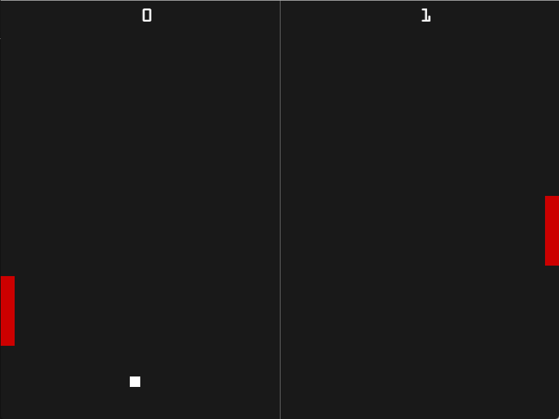

# Piston2dTemplate

This small library intends to be a coding template to quickly develop small apps and games using the [Piston game Engine](https://github.com/PistonDevelopers/piston). The project comprises 2 examples which show how to use it:

1. Mandelbrot Set Browser

`cargo run --release --example mandelbrot`

This app enables you to visualise the [Mandelbrot Set](https://en.wikipedia.org/wiki/Mandelbrot_set) at various levels of zoom and at different points of origin in the display. You can adjust the zoom using PageDown/PageUP keys and move the display window in the complex plane using the Arrow keys. 

2. Classic Pong game

`cargo run --release --example pong`

This game probably does not require any introduction. This is a best-out-of-five 2 player version which can give you a basic understanding on how to implement sprites in Piston.

 
